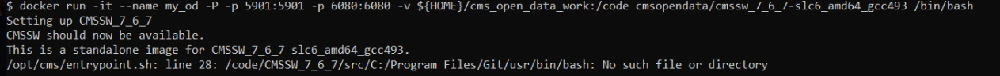

Some frequently asked questions:

- For Linux users, for installing docker, there are (well-hidden) post-installation instructions in [https://docs.docker.com/engine/install/linux-postinstall/](https://docs.docker.com/engine/install/linux-postinstall/)

- Fow Windows WSL2 users: when starting the CMSSW container, if you get the following error message

    {: .image-with-shadow }
you are working in Git Bash and not in the WSL Ubuntu terminal. Try again in the Ubuntu terminal.


