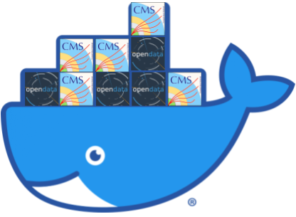

These pre-exercises are designed to prepare you for using Docker in the context of
the CMS Open Data Workshop. This is *not* a full introduction to Docker, however
we do take time to explain some key concepts that should make your experience a smooth one.

Note that you can also use virtual machines (VMs) to interface with the CERN Open Data Portal
and this workshop, and there is a separate pre-exercise for that.

You should definitely take time to go through either this *or* the [VM exercise](https://cms-opendata-workshop.github.io/workshop2021-lesson-virtualmachine/) before
participating in the workshop.

<!-- If you run into problems with any of these steps, please reach out to the organizers
through the dedicated [Mattermost channel][mattermost]. -->

<!-- this is an html comment -->

 This is a comment in Liquid 

> ## Prerequisites
>
> Basic knowledge of [bash](https://swcarpentry.github.io/shell-novice/01-intro/index.html#the-shell)
{: .prereq}


